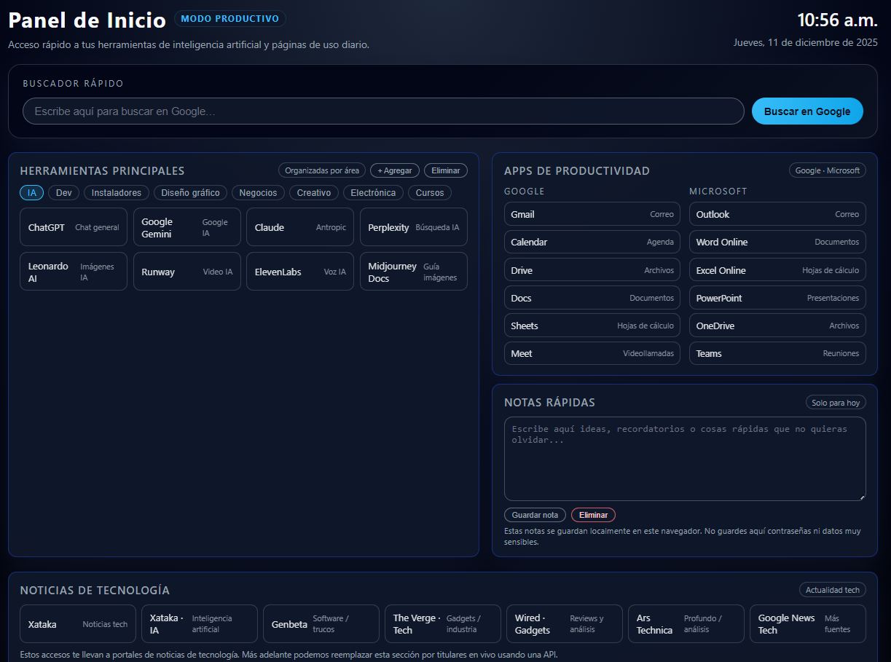

# 🚀 Dashboard Productivo Personal

Página de inicio local para navegadores · HTML + CSS + JavaScript

Este proyecto es un **dashboard productivo personal**, diseñado para servir como **página de inicio** en tu navegador.  
Ofrece accesos rápidos, enlaces organizados por áreas, notas rápidas, reloj en tiempo real y una sección de noticias tecnológicas.  
Toda la información permanece **local** en tu computadora, sin comunicación con servidores externos.

---

## Características principales

### Navegación organizada por áreas

El panel agrupa herramientas y enlaces dentro de pestañas como:

- **IA**
- **Dev**
- **Instaladores**
- **Diseño gráfico**
- **Negocios**
- **Creativo**
- **Electrónica**
- **Cursos**

Todas las categorías tienen estilos uniformes y responsivos.

---

### Enlaces personalizados (Agregar / Eliminar)

Puedes personalizar tu dashboard directamente desde la interfaz:

- Agregar enlaces nuevos mediante prompts guiados
- Validación extensiva con `new URL()`
- Corrección automática cuando falta `https://`
- Límite de 1000 caracteres para prevenir datos corruptos
- Guardado persistente en `localStorage`
- Eliminación selectiva de enlaces personalizados

Cada pestaña administra enlaces independientes.

---

### Notas rápidas (Guardar / Eliminar)

- Guardado automático en `localStorage`
- Botón para **Guardar** cambios
- Botón para **Eliminar** nota
- Incluye advertencia importante:  
  **“No guardes contraseñas ni datos sensibles aquí.”**

---

### Reloj y fecha en tiempo real

- Reloj digital actualizado cada segundo
- Fecha completa en formato español (día, mes, año)

---

### Noticias de tecnología

Incluye accesos directos a:

- Xataka  
- Genbeta  
- Wired  
- Ars Technica  
- The Verge  
- Google News – Tecnología  

En el futuro puede integrarse una API para obtener titulares en vivo.

---

## Seguridad integrada

El dashboard incluye medidas de seguridad modernas:

- **Content Security Policy (CSP)** para evitar ejecuciones externas
- Enlaces externos con:  
  `rel="noopener noreferrer"`
- Evita XSS al no usar `innerHTML` con datos del usuario
- Validación estricta de URLs personalizadas
- No transmite datos a internet
- Todo el almacenamiento es exclusivamente local

---

## Notas importantes

El dashboard está diseñado solo para uso local.

No utiliza backend ni conexión a servidores externos.

localStorage pertenece exclusivamente al navegador donde se usa.

No almacenar información sensible como contraseñas, tokens o datos confidenciales.

Recomendado utilizar computadores de confianza o personales.
